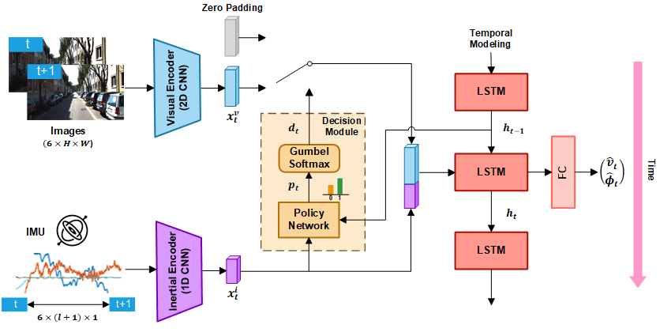
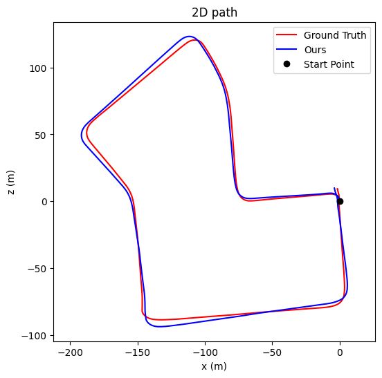

# Visual-Inertial-Odometry-with-Adaptive-Visual-Modality-Selection

This repository contains the codes for [Efficient Deep Visual and Inertial Odometry with Adaptive Visual Modality Selection (ECCV '22)](https://arxiv.org/pdf/2205.06187.pdf). 

 

## Data Preparation

The code in this repository is tested on KITTI Odometry dataset. The IMU data after pre-processing is provided under `data/imus`. To download the images and poses, please run

      $cd data
      $source data_prep.sh 

## Test the pretrained model

Example command:

      python test.py --data_dir './data' --model './pretrain_models/vf_512_if_256_5e-05.model' --gpu_ids '0' --experiment_name 'pretrained'

The figures and error records will be generated under `./results/pretrained/files` The estimated path for path 07 is shown below: 

